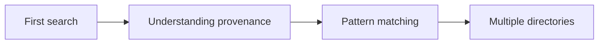

# Tutorials

This section contains learning-oriented lessons that walk through complete examples from start to finish. Start here if you're new to searchpath and want hands-on experience.

## Recommended learning path

If you're new to searchpath, follow these tutorials in order:

1. **Your first search** - Start here to learn the core concepts
2. **Understanding provenance** - Learn why tracking where files come from matters
3. **Pattern matching** - Use glob patterns, includes, and excludes
4. **Searching several directories** - Build config cascades and handle deduplication

## Planned tutorials

Your first search
:   Learn the fundamentals of file discovery with searchpath. Understand [`first()`][searchpath.first], [`SearchPath`][searchpath.SearchPath], and entries.

Understanding provenance
:   Learn how to use [`match()`][searchpath.match] and [`Match`][searchpath.Match] objects to track which directory each file came from.

Pattern matching
:   Use glob patterns to find files by name. Apply include and exclude filters to narrow results.

Searching several directories
:   Build a config cascade that searches project, user, and system directories. Understand scope names and deduplication.

## After completing tutorials

Once you've finished the tutorials, you're ready to:

- **Apply your knowledge** with [how-to guides](../guides/index.md) for specific tasks
- **Deepen understanding** with [explanations](../explanation/index.md) of concepts and architecture
- **Look up details** in the [API reference](../reference/api.md)
